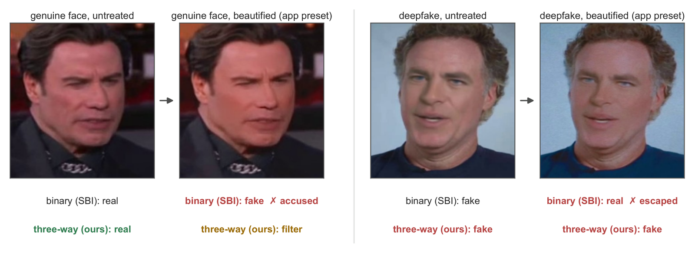
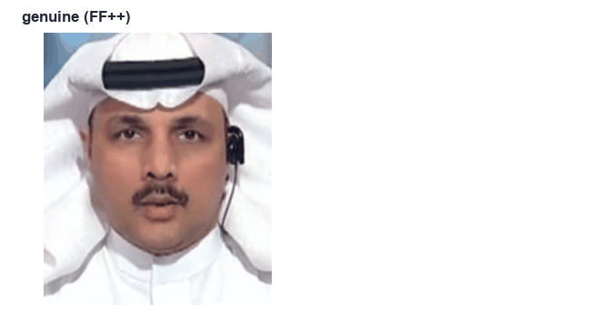
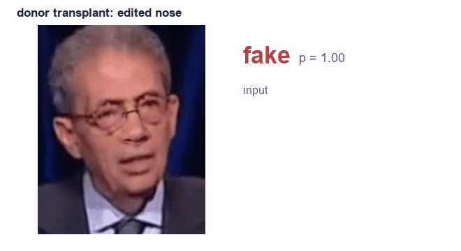
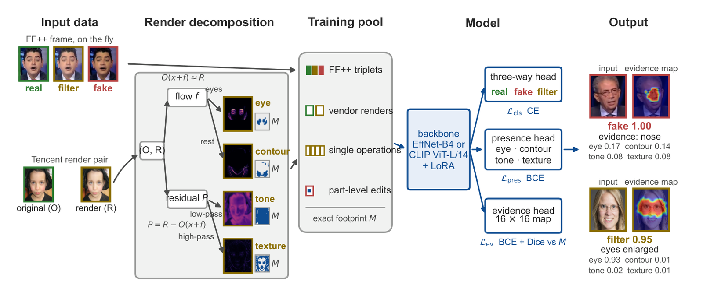
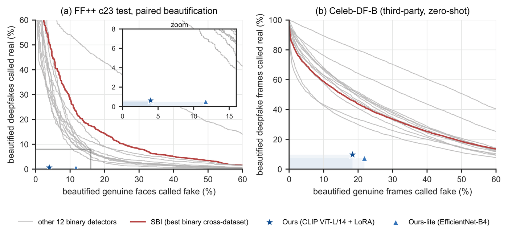
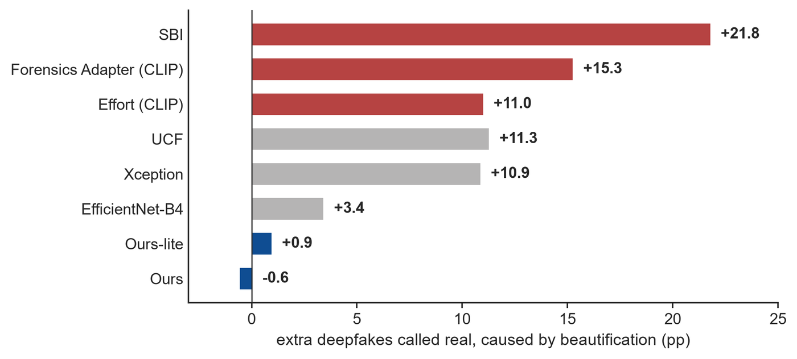
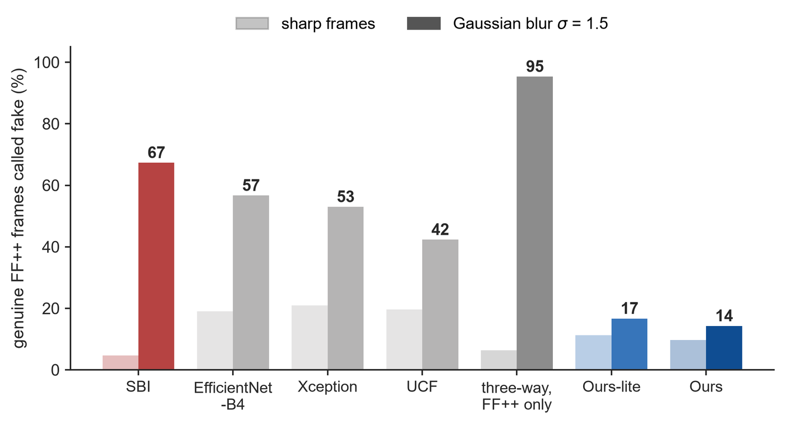
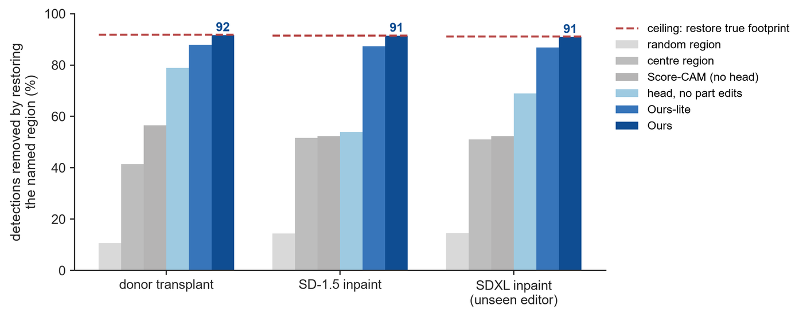

<div align="center">

# Beautified Is Not Forged
### Separating Beautification from Face Forgery

**Qin-Ying Lin, Bo-Rong Chen, Chen-Shan Yu**

[](docs/paper_v2/main_8page.pdf)
[](docs/paper_v2/supplement_latest.pdf)
[](docs/meeting_20260930/meeting_20260930_v3.pptx)
[](https://doreen1113.github.io/beautified-not-forged/docs/demo/)



*A binary detector (SBI) accuses a beautified genuine face and lets a beautified deepfake through.
Our three-way detector calls the first **filter** and the second **fake**.*

</div>

---

## TL;DR

Most face photos are beautified by a camera app or a retouching service before anyone checks them. A real / fake
detector has to put a beautified genuine face on one side or the other, and either choice is an error. We add a third
label, **filter** (identity kept, appearance edited), and train it with supervision from paired originals:
renders of two commercial retouching services split into single-operation components, and part-level forgeries with
exact edit regions. One CLIP ViT-L/14 + LoRA model then

- **ignores beautification**: once re-encoding is accounted for, beautification changes its escape rate by **−0.6 pp**
  on Celeb-DF-B (SBI +21.8, Effort +11.0, Forensics Adapter +15.3);
- **does not accuse commercial retouching**: **0.1 %** of an unseen service's retouched faces are called fake
  (published detectors: 9.5–14.8 % at 5 % FPR on the originals);
- **detects forgeries as well as the 2025 CLIP detectors**: video AUC **0.954** on Celeb-DF-v2 and **0.983** on DFD
  (paired bootstrap vs. Effort and Forensics Adapter: all intervals contain 0; vs. SBI: all above 0);
- **explains where**: restoring the region its evidence head names removes **91 %** of its detections on held-out
  part-level forgeries (ceiling 92 %), and the sentence names the edited part correctly in **98–99 %** of cases.

What is not solved: telling lightly retouched faces from their originals on an unseen service reaches **70 %**
balanced accuracy (our target was 75 %).

## Demo

<table>
<tr>
<td align="center"><br>
<sub><b>System output.</b> Decision, four operation scores, evidence map and a template sentence for examples fixed in
advance; the wrong cases are kept (lifting and whitening are missed, one genuine frame is sent to filter).</sub></td>
<td align="center"><br>
<sub><b>Is the explanation the cause?</b> Held-out part-level forgeries: restoring only the region the model names to
the unedited original removes the <i>fake</i> decision.</sub></td>
</tr>
</table>

**[Live demo](https://doreen1113.github.io/beautified-not-forged/docs/demo/)** ·
**[walkthrough video (54 s)](docs/demo/video/demo_walkthrough.mp4)**: Ours-lite (EfficientNet-B4, same training signal
and heads as the main model) runs in the browser, about 0.5 s per photo, nothing uploaded. It shows the label, the
operation scores, the evidence map, the evidence per facial part and the sentence; its part names match the Python
implementation on 128/128 test crops. The page has eight example faces with their known answers and the model's accuracy
on 50 more faces of each kind, so a visitor can check it; it gets 4 of the 8 examples right. To run it locally:
```bash
cd docs/demo && python -m http.server 8000     # then open http://localhost:8000
```

## Method



- **Three labels.** *real* (unedited), *fake* (identity swapped, reenacted or synthesised), *filter* (identity kept,
  appearance edited). A beautified forgery is still *fake*.
- **Supervision from paired originals.** Every edited training image has a pixel-aligned original, so both its label
  and its exact edit region are known.
- **Render decomposition.** Commercial services apply four edits at once; a model trained on their renders learns only
  the co-occurrence. Dense optical flow and a low/high-pass split of the photometric residual turn each render into
  eye, contour, tone and texture components that recompose it at 108 dB (≈50 k single-operation training images).
- **Symmetric degradation.** The same blur or downscale is applied to the real, filter and fake image of each
  training triplet, so sharpness no longer predicts the class.
- **Three heads on one backbone.** Three-way decision, operation presence, and an evidence map trained with BCE + Dice
  against the exact edit region.

## Results

All detectors are scored with their released weights on the same frames and crops.

| Detector | Params (M) | Celeb-DF-v2 video AUC | DFD video AUC | Celeb-DF-B AUC | Escape added by beautification (pp) |
|---|---:|---:|---:|---:|---:|
| Xception | 21.9 | 0.772 | 0.882 | 0.811 | +10.9 |
| UCF | 21.9 | 0.788 | 0.853 | 0.841 | +11.3 |
| SBI | 17.6 | 0.872 | 0.876 | 0.875 | +21.8 |
| Effort (CLIP) | 303.4 | 0.930 | 0.957 | 0.909 | +11.0 |
| Forensics Adapter (CLIP) | 309.7 | 0.945 | 0.959 | 0.909 | +15.3 |
| **Ours** (CLIP ViT-L/14 + LoRA) | 306.3 | **0.954** | **0.983** | **0.937** | **−0.6** |
| Ours-lite (EfficientNet-B4) | 17.6 | 0.910 | 0.908 | 0.899 | +0.9 |

<sub>Last column: change in the share of Celeb-DF-B deepfakes called real when the videos are beautified, with the
re-encoding effect removed using the benchmark's compression-only videos; binary detectors at 5 % FPR on untreated
genuine frames. Full table (13 detectors, frame-level AUC, paired-corpus errors) in the paper.</sub>

<table>
<tr>
<td width="50%"><br>
<sub><b>No threshold reaches us.</b> Each grey curve is one published detector swept over all thresholds; none enters
the box under our models.</sub></td>
<td width="50%"><br>
<sub><b>Beautification alone lets deepfakes escape</b>, including the 2025 CLIP detectors.</sub></td>
</tr>
<tr>
<td><br>
<sub><b>Blur looks fake to FF++-trained detectors.</b> Degrading all three images of a training triplet together
removes the shortcut.</sub></td>
<td><br>
<sub><b>The evidence map is faithful.</b> Restoring the named region removes 91 % of detections; restoring the true
edit region removes 92 %.</sub></td>
</tr>
</table>

## How far the explanation can be trusted

The sentence is a template filled from the three heads (no language model), so every word can be checked against a
model output. On 379 test images it produces 14 distinct sentences; what differs per image is the numbers behind them.

| The sentence says | Tested on | Correct |
|---|---|---|
| **which part** was forged | held-out part forgeries, 3 editors (SDXL unseen) | 98–99 % |
| **is that part the cause** | restore the part to the original | 91 % of detections removed (ceiling 92 %) |
| **which operation** was applied | held-out faces of the two training services | 0.50 (eyes) to 0.99 (smoothing) |
| | an unseen service | 0.21 (eyes) to 0.96 (smoothing) |
| **how much** was edited | predicted vs. measured amount | Spearman ≤ 0.47, not shown |

## Limitations

- On an unseen retouching service the main model sends 82 % of retouched faces to *filter* but also 42 % of untouched
  originals (balanced accuracy 70 %; Ours-lite 73 %).
- Eye enlargement and face reshaping are often not named on an unseen service; edit magnitudes are not estimated.
- For whole-face swaps the evidence covers the face; no small region carries the decision.
- Strong JPEG (quality 30) raises false alarms on genuine faces by 6 pp (Ours) and 15 pp (Ours-lite).
- Part-level forgeries are detected in 98–99 % of cases on FF++ video frames, but on high-quality FFHQ still photos with
  the same kind of transplant the main model detects 60–92 % and Ours-lite 38–64 %; our scripted strong smoothing on those
  photos is called fake by the main model in 56 % of faces (`docs/demo/make_samples.py`).
- The main model and Ours-lite are single training runs.

## Repository

```
docs/paper_v2/                 paper and supplement (LaTeX), table and figure scripts (every number is read from a result file)
docs/meeting_20260930/         progress-report slides, speaker notes, slide assets and their scripts
docs/demo/                     browser demo of Ours-lite (MediaPipe crop + ONNX Runtime Web; demo_v8_legacy/, demo_ru/ are earlier ones)
docs/readme/make_media.py      the GIFs and figures on this page
results/research/
  retouch_unified_20260929/    main line: render decomposition, training (EfficientNet-B4 and CLIP + LoRA), evaluation,
                               explanation (explain_ours.py), pre-registered targets (PRE_DECLARED.md), FINDINGS.md
  cgd_20260927/                part-level forgeries, evidence head, faithfulness test
  celebdfb_v2_20260927/        Celeb-DF-B escape / accusation protocol
  sota_baselines_20260929/     scoring Effort and Forensics Adapter with their released weights
  ffpp_benchmark_20260925/     FF++ paired corpus, Celeb-DF-v2 / DFD frame lists, video-level AUC
  alipair_zeroshot_20260929/   unseen commercial service (Alibaba) before/after pairs
```

The earlier line of this project (hierarchical ShuffleNetV2 detector `pipeline.py`, data cleaning and filter scripts,
Android / iOS TFLite benchmarks) is preserved at the tag
[`v8-archive`](https://github.com/Doreen1113/beautified-not-forged/tree/v8-archive); its setup notes are in
[`docs/readme/LEGACY_README_v8.md`](docs/readme/LEGACY_README_v8.md).

Datasets and model weights are not in the repository. Data: FaceForensics++, Celeb-DF-v2, DFD, Celeb-DF-B (on request
from its authors), RetouchingFFHQ and FFHQ, each under its own licence.

## Citation

```bibtex
@misc{lin2026beautified,
  title  = {Beautified Is Not Forged: Separating Beautification from Face Forgery},
  author = {Lin, Qin-Ying and Chen, Bo-Rong and Yu, Chen-Shan},
  year   = {2026},
  note   = {Manuscript}
}
```

## Acknowledgements

Celeb-DF-B was provided by Libourel et al. (IWBF 2024). Baseline checkpoints come from DeepfakeBench and from the
official releases of SBI, Effort and Forensics Adapter. Commercial retouching renders are from RetouchingFFHQ.
